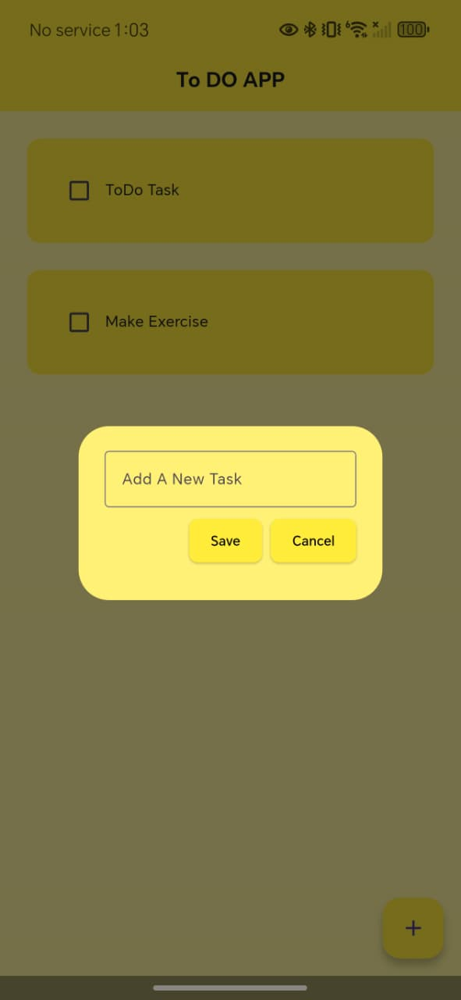
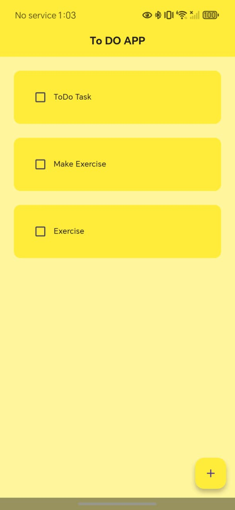
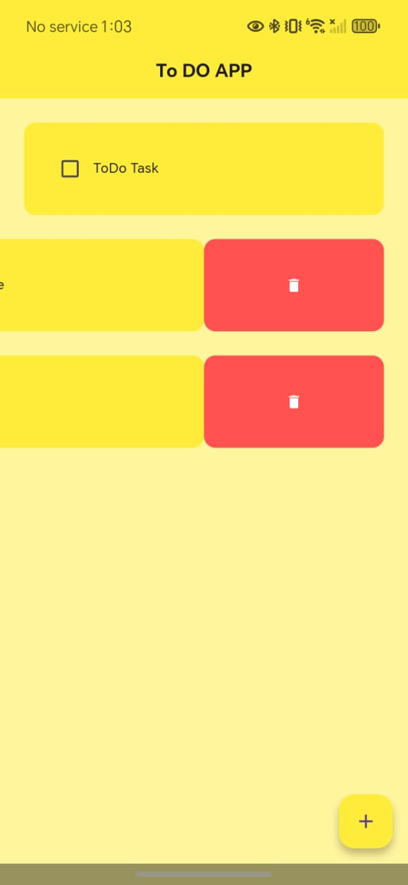
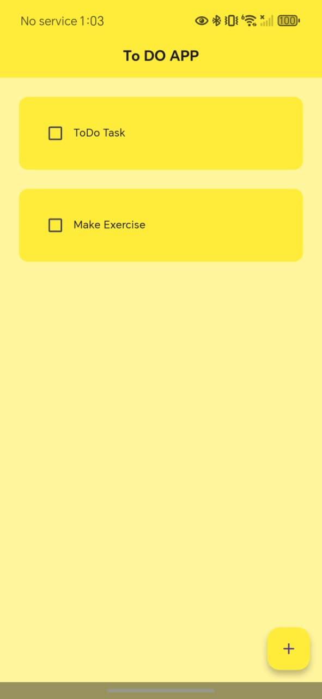

# 📝 To-Do List App (Created By: Talha Shafique)
Simple & Modern Daily Task Manager

## 📦 Description — To-Do List App
The To-Do List App is a clean, fast, and beautifully designed task management application built using Flutter & Dart. The app provides a smooth and intuitive interface where users can easily add tasks, mark them as completed, update task status, and remove tasks using a Slidable delete action. Designed with a bright yellow theme, the app focuses on clarity, simplicity, and productivity. With real-time task updates, smooth animations, and a minimal user-centric layout, this app delivers a seamless and engaging experience for managing daily routines efficiently.

## ⚙️ Technologies Used
- 💻 **Language:** Flutter (Dart)
- 🎨 **UI Framework:** Material 3 + Custom Yellow Theme
- 🧩 **State Management:** Provider / SetState
- ✔️ **Features:** Add Task, Save Task, Mark Complete, Delete with Slidable, Modern UI Components

## 📱 App Screenshots

| **1. Home Screen** | **2. Add Task Screen** | **3. Save Task Screen** | **4. Add Save Task Screen** | **5. Delete Task Screen** | **6. After Delete Task Screen** |
| :---: | :---: | :---: | :---: | :---: | :---: | 
|  |  |  |  |  |  |
